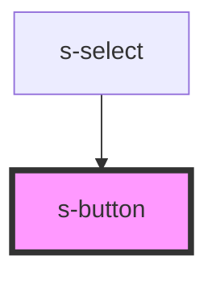

# s-button

<!-- Auto Generated Below -->

## Properties

| Property | Attribute | Description | Type                                | Default     |
| -------- | --------- | ----------- | ----------------------------------- | ----------- |
| `fill`   | `fill`    |             | `"clear" \| "default" \| "outline"` | `'default'` |

## Dependencies

### Used by

 - [s-select](../s-select)

### Graph

----------------------------------------------

*Built with [StencilJS](https://stenciljs.com/)*
