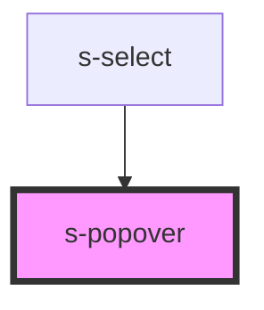

# s-popover

<!-- Auto Generated Below -->

## Properties

| Property          | Attribute          | Description | Type                                                                        | Default           |
| ----------------- | ------------------ | ----------- | --------------------------------------------------------------------------- | ----------------- |
| `isHidden`        | `is-hidden`        |             | `boolean`                                                                   | `true`            |
| `position`        | `position`         |             | `string \| { x?: string; y?: string; offsetX?: string; offsetY?: string; }` | `undefined`       |
| `transformOrigin` | `transform-origin` |             | `string`                                                                    | `'center center'` |
| `zIndex`          | `z-index`          |             | `number`                                                                    | `9999`            |

## Dependencies

### Used by

 - [s-select](../s-select)

### Graph

----------------------------------------------

*Built with [StencilJS](https://stenciljs.com/)*
