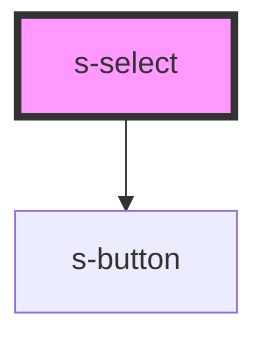

# s-select

<!-- Auto Generated Below -->

## Properties

| Property      | Attribute     | Description | Type                                                                                                            | Default     |
| ------------- | ------------- | ----------- | --------------------------------------------------------------------------------------------------------------- | ----------- |
| `color`       | `color`       |             | `"danger" \| "dark" \| "light" \| "medium" \| "primary" \| "secondary" \| "success" \| "tertiary" \| "warning"` | `'primary'` |
| `placeholder` | `placeholder` |             | `string`                                                                                                        | `undefined` |
| `value`       | `value`       |             | `string`                                                                                                        | `undefined` |

## Events

| Event     | Description | Type                  |
| --------- | ----------- | --------------------- |
| `sChange` |             | `CustomEvent<string>` |

## Dependencies

### Depends on

- [s-button](../s-button)

### Graph

----------------------------------------------

*Built with [StencilJS](https://stenciljs.com/)*
