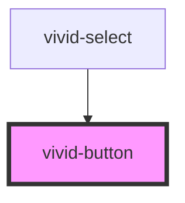

# vivid-button

<!-- Auto Generated Below -->

## Properties

| Property  | Attribute | Description | Type                                                                                                            | Default     |
| --------- | --------- | ----------- | --------------------------------------------------------------------------------------------------------------- | ----------- |
| `color`   | `color`   |             | `"danger" \| "dark" \| "light" \| "medium" \| "primary" \| "secondary" \| "success" \| "tertiary" \| "warning"` | `'primary'` |
| `variant` | `variant` |             | `"clear" \| "outline" \| "solid"`                                                                               | `'solid'`   |

## Dependencies

### Used by

 - [vivid-select](../vivid-select)

### Graph

----------------------------------------------

*Built with [StencilJS](https://stenciljs.com/)*
