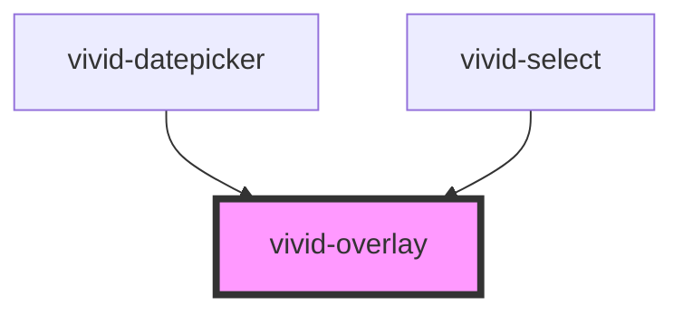

# vivid-overlay

<!-- Auto Generated Below -->

## Properties

| Property          | Attribute          | Description | Type                                                                                                      | Default           |
| ----------------- | ------------------ | ----------- | --------------------------------------------------------------------------------------------------------- | ----------------- |
| `minimizedScale`  | `minimized-scale`  |             | `string`                                                                                                  | `'.001 .001'`     |
| `position`        | `position`         |             | `string \| { x?: string; y?: string; offsetX?: string; offsetY?: string; type?: "fixed" \| "absolute"; }` | `undefined`       |
| `showed`          | `showed`           |             | `boolean`                                                                                                 | `false`           |
| `transformOrigin` | `transform-origin` |             | `string`                                                                                                  | `'center center'` |
| `useBackdrop`     | `use-backdrop`     |             | `boolean`                                                                                                 | `false`           |
| `zIndex`          | `z-index`          |             | `number`                                                                                                  | `100`             |

## Dependencies

### Used by

 - [vivid-datepicker](../vivid-datepicker)
 - [vivid-select](../vivid-select)

### Graph

----------------------------------------------

*Built with [StencilJS](https://stenciljs.com/)*
